# HYSPLIT安装与简单使用教程

作者：林

<!-- begin -->

    
联系邮箱：

    
    <noscript>
        
<i>（为保护隐私，邮箱地址需要启用JavaScript后才能显示。）</i>

    </noscript>

<!-- end -->

本内容为个人学习分享，欢迎参考使用。请勿用于商业用途或未经许可转载至其他平台（如微信公众号等）。

---

## 0.前言

HYSPLIT（Hybrid Single-Particle Lagrangian Integrated Trajectory）是由NOAA开发的大气轨迹模型。

官方教程为全英文，而网上相关的教程数量零散，部分内容年代久远，故编写此中文教程文档供参考。官网的教程可以直接使用使用翻译插件对照操作，如果愿意也可以选择阅读官方文档进行操作。

本教程是在 **win10系统**下安装 **v5.4.2** 版本。主要内容为下载与安装、运行单条后向轨迹、使用HYSPLIT软件自带的绘图功能输出可视化图片。当然也可以选择自己编写python读取文件画图，本教程不直接提供软件安装包和气象数据文件，请通过官方渠道自行获取（链接见下文）。

官方基础教程：[https://www.ready.noaa.gov/documents/Tutorial/html/index.html](https://www.ready.noaa.gov/documents/Tutorial/html/index.html)

获取气象数据：[ftp://arlftp.arlhq.noaa.gov/archives/](ftp://arlftp.arlhq.noaa.gov/archives/)

---

## 1.安装HYSPLIT

### 1.1下载
进入上面的官方基础教程链接，然后点击Installing HYSPLIT下的[Windows PC](https://www.ready.noaa.gov/documents/Tutorial/html/install_win.html)，也可以直接点这个跳转。（下文中将这个界面称为install界面）

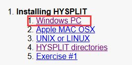

- 下载TCL：在install界面下滑，找到TCL。依次点击下载得到一个zip文件，如果你需要历史版本则请通过Home Page寻找下载，这里直接用最新版即可。

    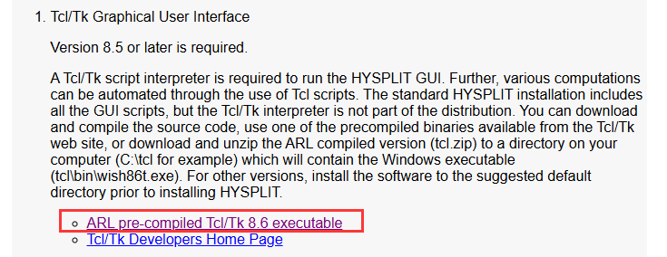

    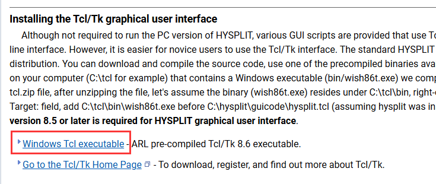

- 下载ImageMagick：install界面，找到ImageMagick File Converter，只有一个链接，点击后跳转到一个新页面（如图），再点击左上标题Download，然后往下滑找到要下载的文件。

    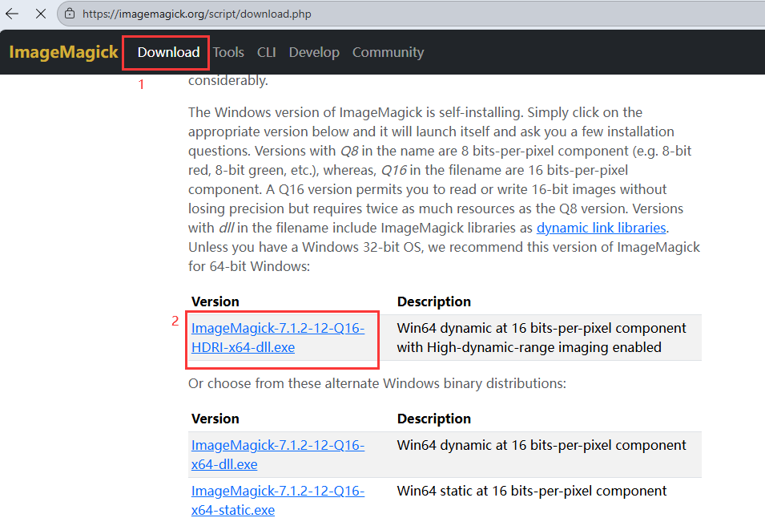

- 下载HYSPLIT：回到install界面，找到HYSPLIT，点击上面的链接。上面的是未注册版本，下面是注册版本。*英文介绍的最后一段内容：未注册版本也是适用于官方给出的所有教程的，除了未注册版本的分散模型（用于浓度预测）只适用于存档数据，不能使用预测数据运行之外没有任何区别。*

    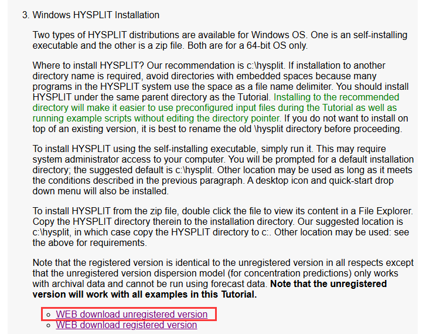

    跳转新界面之后填一下邮箱然后点击“I agree”按钮，邮箱用outlook或者qq都是可以的。进入下载界面，选择上面或下面的都可以，如果你不想装在C盘就选择下载下面的zip文件。我是装在D盘的也没有问题。

    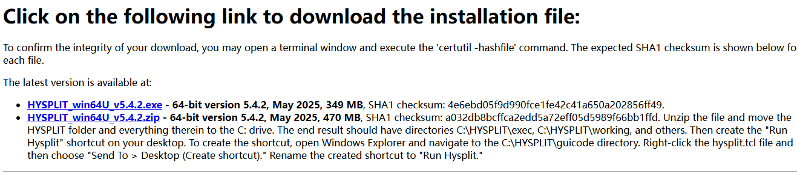

### 1.2安装

按顺序依次安装：TCL->ImageMagick->HYSPLIT

TCL：直接解压缩得到一个文件夹，注意路径。

ImageMagick：双击安装一路点下去，如果你想装在其他盘就手动改一下路径，默认是装在C盘的。勾选内容默认是这两个不用管。

HYSPLIT：下exe的双击安装，zip的直接解压，同样是注意路径。

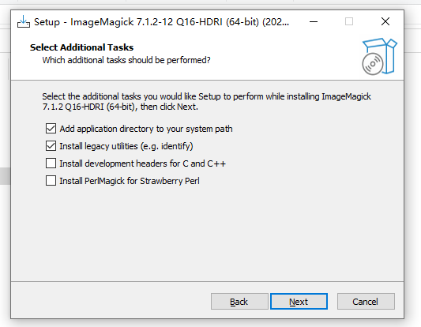

给出我自己装在D盘是这样的：红框的文件夹名称是自己起的，起什么都行不过建议起英文。安装好之后就是这样如图有三个文件夹。

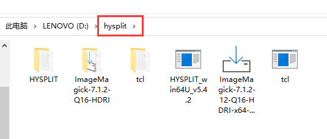

### 1.3配变量和启动
依次点：此电脑->属性->高级系统设置->环境变量进入设置，win10可以直接左下角搜索框搜索环境变量回车进入。分别在系统变量和环境变量选Path然后点编辑，添加tcl和ImageMagick两个路径，这里以我的为例（红框框出来的位置）：`D:\hysplit\tcl\tcl\bin` 、`D:\hysplit\ImageMagick-7.1.2-Q16-HDRI`

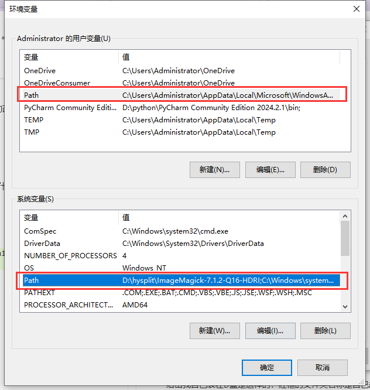

设置好之后在桌面找到快捷方式，如果找不到那就进入文件夹HYSPLIT->guicode找到hysplit.tcl。右键打开方式选择文件夹tcl->bin里的wish86t.exe。

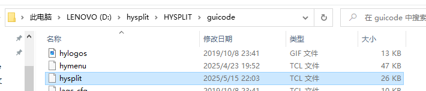

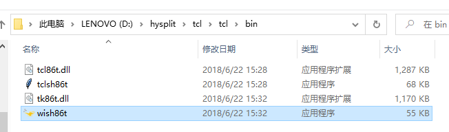

启动成功后就弹出程序界面，再点击Menu就可以开始使用了：我们打开的实际上是一个GUI界面，实际上HYSPLIT也可以通过编写CONTROL或者编写脚本批量运行。这里只介绍使用GUI界面。

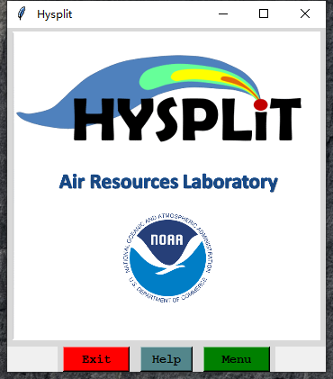

## 2.准备数据
HYSPLIT使用由NOAA ARL打包的专用格式数据。具体的数据获取方法、数据介绍网络上有很多相关教程，这里不详细赘述，只介绍使用FTP获取再分析资料。

在前言中给出了一个获取气象数据的链接，复制粘贴这个链接在浏览器或文件夹路径就能打开文件夹，选择需要的数据下载即可。要注意的是，所有的数据都是世界时(UTC)。下载后的数据放在你能找得到的文件夹即可，不限制要与HYSPLIT放在在一个盘里。这里给出我在文件夹打开的展示：

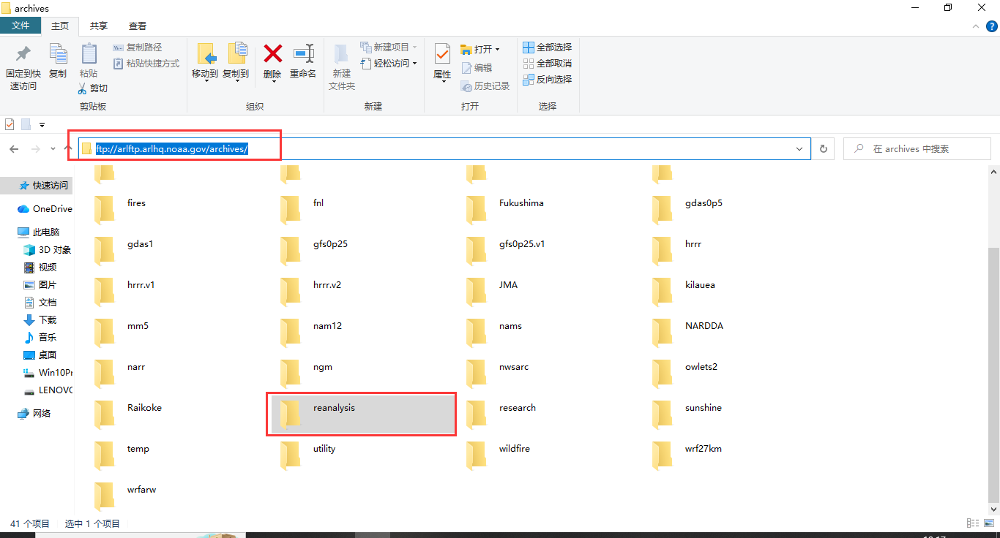

## 3.单条后向轨迹

### 3.1运行轨迹

(1)设置模型：点开Trajectory->Setup Run，会出现如图右侧窗口

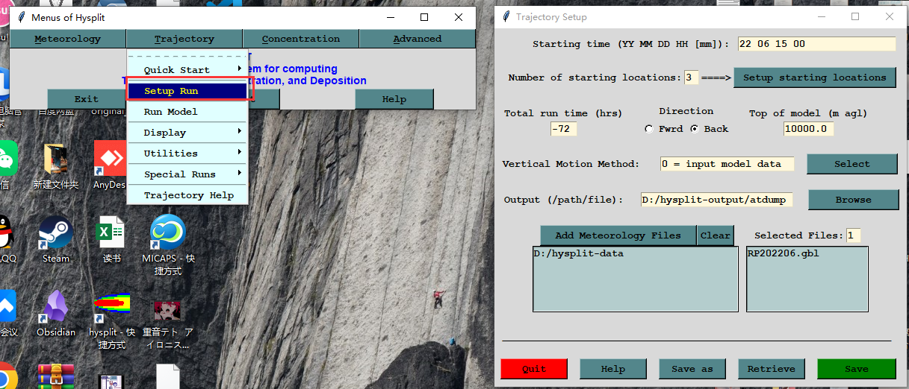

(2)设置模型起始时间，格式是年\月\日\时，中间用空格隔开：

(3)设置垂直分为几层，可以选择一至多层，这里演示选择三层。点击Setup starting locations进入详细设置，这里演示设置为40°N、90°W、最后一项为离地高度单位为米。实际使用中可以写入更高精度的坐标点。

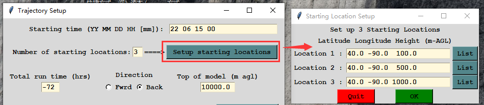

(4)选择向后模拟方向（Back）；模式模拟时间为向后的72小时（负号即表示向后）；模式顶高度一般默认10000m。

(5)设置垂直运动方法：一般默认使用0模式，对其他方法感兴趣的可以点击右边选择框中的Help自行查看介绍。

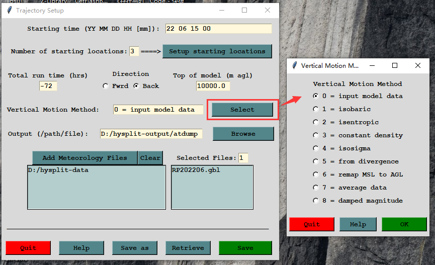

(6)设置输出路径：如果不修改一般是默认保存在HYSPLIT\working或HYSPLIT\clust\working文件夹下。个人建议改为更易寻找的专用文件夹放置。点击Browse会打开文件夹让你寻找文件然后输出后会覆盖它。图片演示输出为放在D:\hysplit-output文件夹下的a.tdump文件，你可以点击路径框直接写入，对命名没有限制（最好不要输中文），要注意输入路径的斜杠方向。举例：D:/hysplit-output/1tdump（即1.tdump文件）、D:/hysplit-output/qaqtdump（即qaq.tdump文件）。

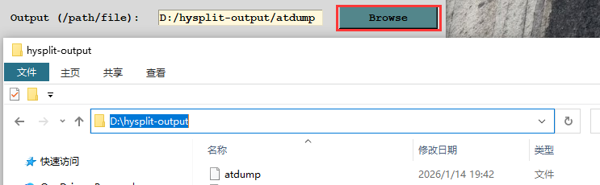

(7)选择使用的资料：点击Add Meteorology Files添加前文中我们下载的气象资料，如果选错了点击Clear即可清除。

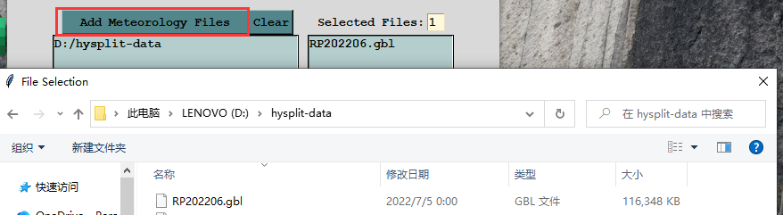

(8)以上设置好后点击Save保存设置，你也可以点击Save as另存为其他路径及命名的CONTRAL文件。

(9)点击Run Model运行模型稍等片刻，完成后如图显示"Complete Hysplit"，就能在刚刚的输出路径指定的文件夹找到对应命名的文件。

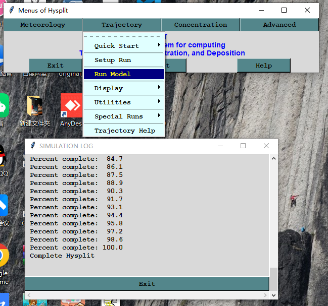

### 3.2绘图

使用HYSPLIT自带的绘图工具对输出的tdump文件进行绘图，当然你也可以选择用python等其他工具进行可视化，这里只介绍HYSPLIT的绘图方法。

点击Display->Trajectory弹出右边的框。Input即选择你要进行绘图的数据源文件，Vertical Coordinate选择垂直坐标类型，一般选择气压（Pressure）或者米高度（Meters-agl），一般只改动这两项就可以输出画图了其他的默认就行。对其他项设置感兴趣的可以点击底下的Help自行查看介绍。

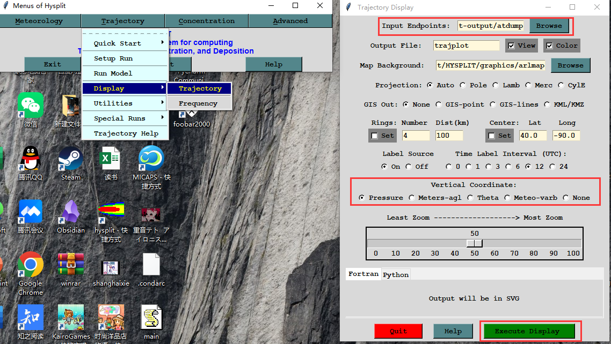

设置好后点击Execute Display就会弹出一个浏览器打开的html文件展示绘图结果：

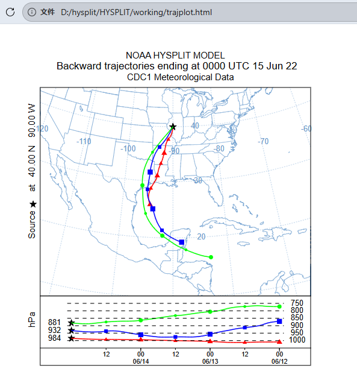
